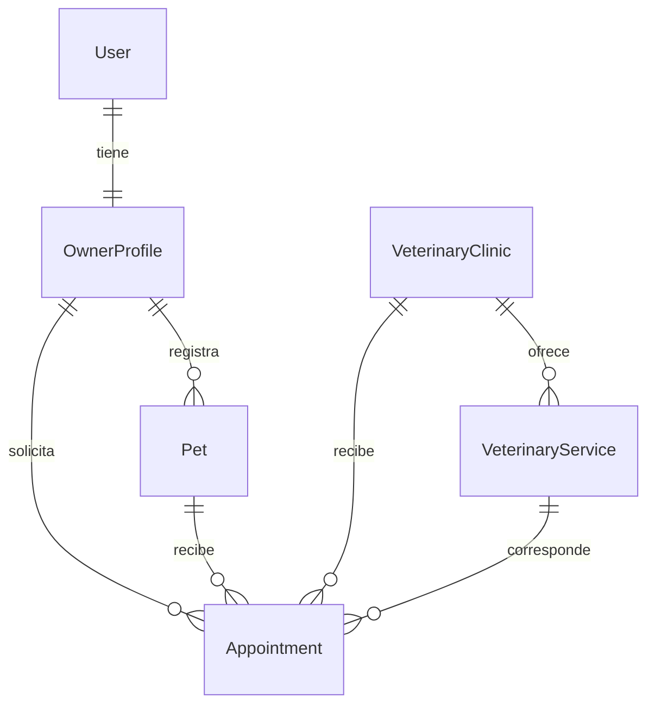

# Decisiones del modelo

## Relaciones

Cada entidad usa una PK entera, `created_at` y `updated_at` con zona horaria. SQLAlchemy actualiza `updated_at` y los triggers de PostgreSQL también lo mantienen ante escrituras SQL externas.

- **User** contiene email, hash y versión de sesión; **OwnerProfile** contiene nombres, apellidos y teléfono. La FK única impone como máximo un perfil por usuario; el registro crea ambos de forma atómica. No hay endpoints de roles ni paneles de otros actores.
- El email se normaliza a minúsculas, se valida con EmailStr y tiene índice único. Un CHECK exige la forma normalizada también en la base.
- **Pet.owner_id** apunta al perfil, nunca a un valor confiado desde el formulario. Se indexa para las consultas del propietario. Especie y sexo se restringen con CHECK; peso positivo con dos decimales, hasta 1000 kg, para admitir distintas especies.
- La fecha aproximada de nacimiento se guarda como DATE. Frontend y backend rechazan fechas inválidas o futuras; la fecha actual se evalúa en Lima. La antigüedad mínima aceptada es 1900-01-01 para especies longevas.
- La baja de mascota es lógica (`deleted_at`). Se bloquea mientras haya cualquier cita pendiente, incluso pasada, para que la decisión de cancelarla sea explícita. Las citas canceladas conservan su relación y siguen consultables.
- Las FK usan `RESTRICT` para evitar borrados en cascada accidentales. No hay eliminación de cuentas, clínicas ni servicios en el sprint. Las PK no se editan y PostgreSQL rechaza actualizaciones que romperían referencias.
- **VeterinaryService** pertenece a una clínica. Nombre único dentro de cada clínica, precio decimal no negativo y duración positiva. El seed agrega sin sobrescribir y usa un advisory lock transaccional para impedir duplicados si dos arranques coinciden.
- **Appointment** tiene FK compuesta `(pet_id, owner_id)` y `(service_id, clinic_id)`: la base refuerza tanto la propiedad como la coherencia entre servicio y clínica. El backend comprueba además ambos vínculos antes de insertar.
- Solo hay estados `Pendiente` y `Cancelada`, con CHECK en PostgreSQL. La creación no acepta `owner_id` ni `status` enviados por el cliente. Cancelar de nuevo devuelve 409.
- `starts_at` usa TIMESTAMPTZ. La API exige una fecha con zona horaria; el formulario envía `-05:00` y la UI siempre representa los horarios en `America/Lima`, independientemente de la zona del dispositivo.
- Un índice compuesto `(owner_id, status, starts_at)` acelera consultas del propietario; también se indexan las FK de mascotas y servicios. El catálogo tiene índices de nombre; la búsqueda parcial usa ILIKE con caracteres comodín escapados. Para el catálogo pequeño basta; trigramas y paginación quedan como mejoras según volumen.
- El bloqueo de fila de mascota serializa creación de cita y eliminación: una mascota no puede darse de baja entre verificar su propiedad y guardar la cita. La cancelación también toma un bloqueo para controlar solicitudes simultáneas.
- Los nombres y precios en el detalle de una cita reflejan el catálogo actual. No hay panel que lo edite en Sprint 1; un futuro sprint que permita modificar precios deberá considerar instantáneas de los datos de la solicitud.

## Sesiones y HTTP

JWT en cookie HttpOnly: la navegación no almacena ni inventa la autenticación. Cada endpoint privado valida firma HS256, expiración, emisor, audiencia y versión en PostgreSQL. La cookie expira a los 60 minutos; no hay refresh token. Un 401 redirige al login y limpia la caché privada. La aplicación valida la sesión al volver a enfocar la ventana y el servidor la valida en cada petición.

Las respuestas de cuenta nunca incluyen hash, versión de sesión ni token. Los errores de validación no devuelven el valor recibido, evitando exponer contraseñas. Se mantiene un formato de error único y CORS limitado. Las consultas fallidas a PostgreSQL devuelven 503 sin SQL ni parámetros sensibles.

`GET /api/docs` se sirve a través de Nginx con una política de contenidos específica para los assets de Swagger. Las páginas de la aplicación mantienen una política más restrictiva. El logout invalida las sesiones de toda la cuenta.

## Límites explícitos

No se calcula disponibilidad por profesional, no se previenen solapamientos entre solicitudes y no se confirma la atención. Una solicitud puede estar fuera del horario informativo; la UI lo presenta como propuesta sin reserva. La validación obligatoria es que la fecha/hora sea futura. Sin este límite, sería necesario modelar turnos, personal y capacidad, fuera de US07.

El uso local por Compose es el objetivo de despliegue. No se reemplazó FastAPI/PostgreSQL por un backend de hosting de Sites. La guía de Sites se usó para el diseño del frontend, respetando el stack solicitado.
